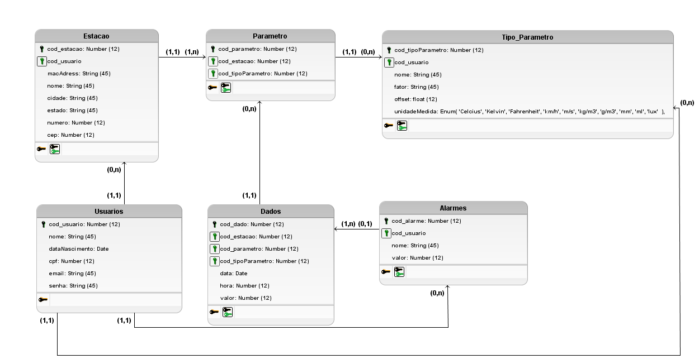
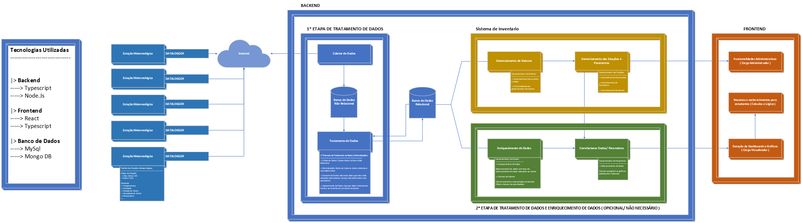

 

<h1 align="center">API 2024.2 - SETH</h1>
 

     <a href="#sobre">Sobre</a> • 
     <a href="#tecnologias">Ferramentas e Tecnologias</a> •
     <a href="#entregas">Entregas</a> • 
     <a href="#metodologia">Integração e Entrega Contínua</a> •
     <a href="#backlog">Backlogs e User Stories</a> •
     <a href="#documentacao">Documentação</a> •
     <a href="#equipe">Equipe</a> 

# 👋Hello! Nós somos o grupo BananaScript
Nós somos estudantes da <a href='https://fatecsjc-prd.azurewebsites.net/'>FATEC de São José dos Campos</a>e estamos no 4º semestre de Desenvolvimento de Software e multiplataformas.

### Sobre o projeto:

A Tecsus é uma startup que se especializa na coleta e processamento de dados utilizando redes de sensores sem fio, também conhecidas como Internet das Coisas (IoT). Esses dados são aplicados em setores como abastecimento de água, distribuição de eletricidade e gás natural. Com o objetivo de diversificar seu portfólio para incluir o monitoramento ambiental e integrar alunos do Ensino Médio em uma abordagem de aprendizagem baseada em problemas, a Tecsus decidiu criar estações meteorológicas acessíveis e de baixo custo.

Para garantir o sucesso desse projeto, é essencial que os dados enviados pelos sensores sejam coletados e processados de forma que possam ser exibidos em um portal, com relatórios e dashboards. Além de fornecer informações e incluir conceitos matemáticos para o cálculo dos parâmetros, o sistema também visa demonstrar a importância do monitoramento ambiental. Isso é feito através da geração de alertas, ajudando a prevenir possíveis desastres naturais.

 #### Status do projeto: Em Desenvolvimento ⏳
  
  
 
 
 
 ### Ferramentas e Tecnologias⚒️
 
 
 

 
 
 
  

 
 

 
  
 

### Entregas✅

Sprint ID | Data | Histórico | Status |
----------|------|-----------|--------|
#1 | 09.09.2024 - 29.09.2024 | <a href="">Relatório</a>| ❌
#2 | 30.09.2024 - 20.10.2024 | <a href="">Relatório</a> | ❌
#3 | 21.10.2024 - 10.11.2024 | <a href="">Relatório</a> | ❌
#4 | 11.11.2024 - 01.12.2024 | <a href="">Relatório</a> | ❌

 

### Integração e Entrega Contínua🚚

    A integração contínua e a entrega contínua são práticas essenciais para o desenvolvimento ágil e de alta qualidade em projetos de software. A integração contínua permite identificar e resolver problemas de integração rapidamente, enquanto a entrega contínua possibilita a liberação rápida de novas funcionalidades para os usuários. Para aplicar essas práticas, é fundamental utilizar ferramentas e técnicas específicas, como sistemas de integração contínua, testes automatizados e ferramentas de deployment automatizado. Essas ferramentas não apenas aumentam a eficiência do processo de desenvolvimento, mas também promovem um ambiente colaborativo e ágil, com foco na entrega de valor para o usuário final.

<ul>

</ul>
 
 

 
 ### Backlogs e User Stories📖
 

<h4> Backlog do produto</h4>
 

 

<h4> User Stories</h4>
 

 

 

 
 ### Documentação📄
 
<h4>Modelo de Dados</h4>
 

 
<h4>Arquitetura do Projeto</h4>
 

 

 

### Equipe👨‍💻:

| Nome | LinkedIn | Github |
|:-----:|:----------:|:---------:|
| Bruno Fernandes ||
| Douglas Medeiros ||
| Gustavo Borges  ||
| Kaue Riki ||
| Lucca Vilela ||
| Miguel Conde ||
| Gabriel Henrique Siqueira ||

 

> Instituição: Fatec São José dos Campos - Prof. Jessen Vidal
> 
> Curso: Desenvolvimento de Software Multiplataforma/4º Semestre
 
 
 
<a href="#inicio">[Voltar ao início]</a>
