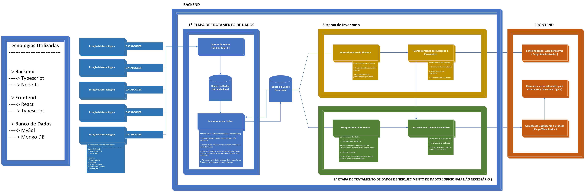

 

<h1 align="center">API 2024.2 - SETH</h1>
 

     <a href="#sobre">Sobre</a> •
     <a href="https://github.com/BananaScripts/Meteorological-Data-Collector/wiki/Configura%C3%A7%C3%A3o-de-Ambiente">Como rodar o projeto</a> •
     <a href="#tecnologias">Ferramentas e Tecnologias</a> •
     <a href="#entregas">Entregas</a> • 
     <a href="#backlog">Backlogs e User Stories</a> •
     <a href="#documentacao">Documentação</a> •
     <a href="#equipe">Equipe</a> 

# 👋Hello! Nós somos o grupo BananaScript
Nós somos estudantes da <a href='https://fatecsjc-prd.azurewebsites.net/'>FATEC de São José dos Campos</a> e estamos no 4º semestre de Desenvolvimento de Software e multiplataformas.

### Sobre o projeto:

A Tecsus é uma startup que se especializa na coleta e processamento de dados utilizando redes de sensores sem fio, também conhecidas como Internet das Coisas (IoT). Esses dados são aplicados em setores como abastecimento de água, distribuição de eletricidade e gás natural. Com o objetivo de diversificar seu portfólio para incluir o monitoramento ambiental e integrar alunos do Ensino Médio em uma abordagem de aprendizagem baseada em problemas, a Tecsus decidiu criar estações meteorológicas acessíveis e de baixo custo.

Para garantir o sucesso desse projeto, é essencial que os dados enviados pelos sensores sejam coletados e processados de forma que possam ser exibidos em um portal, com relatórios e dashboards. Além de fornecer informações e incluir conceitos matemáticos para o cálculo dos parâmetros, o sistema também visa demonstrar a importância do monitoramento ambiental. Isso é feito através da geração de alertas, ajudando a prevenir possíveis desastres naturais.

### Apresentação do problema:

A empresa Tecsus realiza a coleta e o processamento de dados através de redes de sensores sem
fio, também conhecidos como IoT (Internet das Coisas), na área de utilidades (água, energia e gás).
Os dados são transmitidos por diversos meios de comunicação, dentre eles Sigfox, LoRa e GSM. A
fim de expandir seu portfólio para o monitoramento ambiental, a empresa gostaria de
experimentar o desenvolvimento de estações meteorológicas de baixo custo, com os seguintes
sensores: direção e velocidade do vento, índice pluviométrico, umidade, temperatura e pressão.
Essas informações devem ser coletadas periodicamente e enviadas para um servidor, onde os dados
devem ser recepcionados, tratados e exibidos em um portal capaz de disponibilizar relatórios e
dashboards. Com o intuito de envolver os alunos do ensino médio com a aprendizagem baseada
em problemas, o portal deve demonstrar os conceitos matemáticos envolvidos nos cálculos dos
parâmetros, bem como relacionar a importância do monitoramento ambiental como ferramenta
para evitar desastres naturais através da geração de alertas. Serão disponibilizados alguns kits de
estação meteorológica que, ao final do projeto, deverão ser instalados na Escola Estadual Elmano
Ferreira Veloso e na Fatec de São José dos Campos.

<a href="https://github.com/BananaScripts/Meteorological-Data-Collector/wiki/Documenta%C3%A7%C3%A3o-do-produto">Para mais informações, dê uma olhada na documentação do produto</a>

 

## Link dos repositórios

Link do repositório do Front-end: <a href="https://github.com/BananaScripts/Meteorological-Data-Collector-Frontend/tree/main">https://github.com/BananaScripts/Meteorological-Data-Collector-Frontend/tree/main</a>

Link do repositório do Back-end: <a href="https://github.com/BananaScripts/Meteorological-Data-Collector-Backend/tree/main">https://github.com/BananaScripts/Meteorological-Data-Collector-Backend/tree/main</a>

 #### Status do projeto: Em Desenvolvimento ⏳
  

<a href="https://github.com/BananaScripts/Meteorological-Data-Collector/wiki/Configura%C3%A7%C3%A3o-de-Ambiente">Como rodar o projeto</a>

  
 
 
 
 ### Ferramentas e Tecnologias⚒️
 
 
 

 
 
 
  

 

 
  
 

### Entregas✅

Sprint ID | Data | Status | Relatório |
----------|------| --------|--------- |
#1 | 09.09.2024 - 29.09.2024 | ✅ | <a href="https://github.com/BananaScripts/Meteorological-Data-Collector/wiki/Sprint-%E2%80%90-1">Sprint 1</a>
#2 | 30.09.2024 - 20.10.2024 | ✅ | <a href="https://github.com/BananaScripts/Meteorological-Data-Collector/wiki/Sprint-%E2%80%90-2">Sprint 2</a> 
#3 | 21.10.2024 - 10.11.2024 | ❌ | <a href="https://github.com/BananaScripts/Meteorological-Data-Collector/wiki/Sprint-%E2%80%90-3">Sprint 3</a>
#4 | 11.11.2024 - 01.12.2024 | ❌ | <a href="https://github.com/BananaScripts/Meteorological-Data-Collector/wiki/Sprint-%E2%80%90-4">Sprint 4</a>

 

## Requisitos

| **ID** | **Requisitos Funcionais**                                                           | **Prioridade** |
|--------|-------------------------------------------------------------------------------------|----------------|
| 1      | Captação de dados das estações ao longo do tempo                                    | Alta           |
| 2      | Montagem de uma estação meteorológica                                               | Alta           |
| 3      | Gerenciamento das estações, parâmetros, alertas e usuários                          | Alta           |
| 4      | Recepção de dados das estações meteorológicas                                       | Alta           |
| 5      | Dashboards para visualização dos parâmetros meteorológicos                          | Média          |
| 6      | Geração de alertas                                                                  | Média          |
| 7      | Visualização dos alertas quando disparados                                          | Média          |
| 8      | Tutorial para os alunos sobre o significado de cada parâmetro meteorológico         | Média          |

**Requisitos Não Funcionais**                                                   |
----------------------------------------------------------------------------------|
| 9       | Implementar CI/CD                                                                |
| 10      | Instigar nos alunos do ensino médio o gosto pelo estudo através da aprendizagem baseada em problemas |
| 11      | Documentação                  | 
| 12      | Deploy automático |

## Product Backlog 📖

| **Requisito** | **ID** | **Item**                                                                                     | **Prioridade** |
|---------------|--------|----------------------------------------------------------------------------------------------|----------------|
| 3             | 1      | Desenvolver tela de cadastro para estação, com campos de nome, localização e UUID único      | Alta           |
| 3             | 2      | Criar interface para listar estações                                                         | Alta           |
| 3             | 3      | Editar informações das estações                                                              | Alta           |
| 3             | 4      | Opção para exclusão e edição das estações                                                    | Alta           |
| 3             | 5      | Definir e configurar tipos de parâmetros monitorados por estação                             | Alta           |
| 3             | 6      | Editar tipos de parâmetros monitorados por estação                                           | Alta           |
| 3             | 7      | Tela para exibir tipos de parâmetros cadastrados                                             | Alta           |
| 3             | 8      | Exclusão de parâmetros, garantindo ausência de dados vinculados                              | Alta           |
| 3             | 9      | Formulário de cadastro de usuários com nome, email, senha                                    | Alta           |
| 3             | 10     | Tela para listar todos os usuários cadastrados                                               | Alta           |
| 3             | 11     | Funcionalidade de edição de usuários                                                         | Alta           |
| 3             | 12     | Exclusão de usuários, garantindo ausência de dados críticos vinculados                       | Alta           |
| 6             | 13     | Definição de condições de alerta para cada parâmetro monitorado                              | Alta           |
| 6             | 14     | Opções para excluir e editar alerta                                                          | Alta           |
| 4             | 15     | Modelar banco de dados relacional para armazenar dados de estações e parâmetros              | Alta           |
| 4             | 16     | Arquitetura do projeto, abrangendo estrutura geral do sistema                                | Alta           |
| 1             | 17     | Refatoração do código do backend                                                             | Média          |
| 1             | 18     | Simulação de envio de dados das estações                                                     | Média          |
| 1             | 19     | Sistema para organizar e processar dados recebidos                                           | Média          |
| 4             | 20     | Criar banco de dados não relacional para armazenamento de dados                              | Média          |
| 5             | 21     | Dashboards interativos para visualização dos dados coletados                                 | Média          |
| 12            | 22     | Deploy do banco de dados na web                                                              | Média          |
| 4             | 23     | Implementação do banco de dados no Prisma                                                    | Média          |
| 2             | 24     | Implementação das estações meteorológicas funcionando no sistema                             | Média          |
| 1             | 25     | Recepção automática de dados das estações, com registro de data e hora                       | Média          |
| 3             | 26     | Identificação de estações pelo UUID ao receber dados                                         | Média          |
| 1             | 27     | Sistema de processamento de dados para tratamento das informações das estações               | Média          |
| 7             | 28     | Sistema de notificações automáticas para alertas                                             | Média          |
| 7             | 29     | Registro automático de alertas no histórico, com dados de data, estação e parâmetro          | Média          |
| 6             | 30     | Tela de histórico de alertas, com filtros por data, estação e parâmetro                      | Média          |
| 7             | 31     | Resposta visual no frontend para alertas gerados                                             | Média          |
| 12            | 32     | Deploy da aplicação                                                                          | Média          |
| 3             | 33     | Sistema de login e criação de conta                                                          | Média          |
| 8             | 34     | Funcionalidade de textos explicativos para cada tipo de parâmetro monitorado                | Baixa          |
| 8             | 35     | Telas explicativas visuais sobre o significado e importância de cada parâmetro meteorológico | Baixa          |

## Tarefas das Sprints

| **ID** | **Descrição**                                                                                             | **Sprint** 
|--------|-----------------------------------------------------------------------------------------------------------|------------|
| 1      | Desenvolver uma tela de cadastro para estação com campos para nome, localização e UUID único. Validar dados e evitar duplicidades. |
| 2      | Criar uma interface intuitiva para listar todas as estações cadastradas.                                   | 1          | 
| 3      | Implementar a funcionalidade de editar informações das estações                                            | 1          | 
| 4      | Desenvolver uma opção de exclusão e edição das estações.                                                   | 1          | 
| 5      | Definir e configurar tipos de parâmetros monitorados por estação, como nome, unidade e fator de conversão. | 1          | 
| 6      | Editar tipos de parâmetros monitorados por estação, com atualização de nome, unidade e fator de conversão. | 1          |
| 7      | Criar uma tela para exibir todos os tipos de parâmetros cadastrados com suas unidades e fatores.           | 1          |
| 8      | Permitir exclusão de parâmetros, garantindo que não haja dados vinculados antes de proceder.               | 1          |
| 9      | Desenvolver formulário de cadastro de usuários com nome, email, senha.                                     | 1          |
| 10     | Criar uma tela para listar todos os usuários cadastrados.                                                  | 1          |
| 11     | Implementar funcionalidade de edição de usuários, permitindo alteração de nome, email e senha.             | 1          |
| 12     | Desenvolver opção de exclusão de usuários, garantindo que não haja dados críticos vinculados ao usuário antes da exclusão. | 1 |
| 13     | Implementar a definição de condições de alerta para cada parâmetro monitorado.                             | 1          |
| 14     | Implementar opções de excluir e editar alerta.                                                             | 1          |
| 15     | Modelar banco da dados relacional MySQL onde serão armazenados os dados de Estação, Parâmetro, Dados do Parâmetro, Tipo do Parâmetro, Alertas, Histórico dos Alertas e Usuário. | 1 |
| 16     | Desenvolver a arquitetura do projeto, englobando a estrutura geral do sistema.                             | 1          |
| 17     | Refatorar Código do Backend                                                                                | 2          |
| 18     | Simular envio de dados das estações                                                                        | 2          | 
| 19     | Desenvolver sistema para organizar e processar dados recebidos, descartando informações inválidas.         | 2          | 
| 20     | Criar Banco de dados não relacional                                                                        | 2          |
| 21     | Implementar Dashboards interativos para os usuários visualizarem os dados coletados pelas estações, incluindo gráficos. | 2 |
| 22     | Deploy do banco de dados na web                                                                            | 2          | 
| 23     | Implementar banco de dados no prisma                                                                       | 2          | 
| 24     | Implementar as estações meteorológicas funcionando no sistema.                                             | 3          | 
| 25     | Implementar a recepção automática dos dados das estações, registrando data e hora de envio também.         | 3          | 
| 26     | O sistema deve identificar estações pelo UUID único ao receber dados e validar a integridade das informações. | 3          | 
| 27     | Terminar sistema de processamento de dados, acrescentando o tratamento dos dados das estações.             | 3          |
| 28     | Desenvolver sistema de notificações automáticas para os alertas quando acionadas.                          | 3          | 
| 29     | O sistema deve registrar automaticamente alertas armazenado no histórico de alertas, armazenando data, estação e parâmetro responsável. | 3 |
| 30     | Criar uma tela de histórico de alertas, com filtros por data, estação e tipo de parâmetro.                 | 3          | 
| 31     | Desenvolver resposta visual no frontend do alerta gerado.                                                  | 3          |
| 32     | Fazer deploy da aplicação                                                                                  | 3          | 
| 33     | Sistema de login e criação de conta                                                                        | 4          |
| 34     | Adicionar a funcionalidade de acessar textos explicativos detalhados para cada tipo de parâmetro monitorado. | 4 |
| 35     | Criar telas que mostrem explicações visuais sobre o significado e importância de cada parâmetro meteorológico, ajudando o usuário a interpretar os dados. | 4 |

<a href="/Docs/BacklogPorSprint.pdf">Backlog separado por Sprint</a>

## User Stories 📖

| **ID dos Requisitos** | **User Stories**                                                                                                              | **ID Product Backlog** |
|-----------------------|-------------------------------------------------------------------------------------------------------------------------------|------------------------|
| 3                     | Como administrador, quero cadastrar novas estações meteorológicas, fornecendo informações como nome, localização e UUID, para que elas possam enviar dados ao sistema. | 1                      |
| 3                     | Como administrador, quero uma interface intuitiva para visualizar e gerenciar todas as estações cadastradas e verificar suas informações. | 2                      |
| 3                     | Como administrador, quero editar as informações de uma estação já cadastrada, como nome ou localização, para manter os dados atualizados. | 3                      |
| 3                     | Como administrador, quero excluir uma estação meteorológica do sistema para remover estações que não estão mais em uso. | 4                      |
| 3                     | Como administrador, quero definir e configurar os tipos de parâmetros monitorados por cada estação, garantindo a coleta de dados adequados. | 5                      |
| 3                     | Como administrador, quero editar os tipos de parâmetros monitorados por cada estação para ajustar medições conforme necessário. | 6                      |
| 3                     | Como administrador, quero visualizar uma lista dos tipos de parâmetros com suas unidades de medida e fatores para ajustar configurações. | 7                      |
| 3                     | Como administrador, quero excluir tipos de parâmetros que não são mais necessários para o monitoramento das estações. | 8                      |
| 6                     | Como administrador, quero configurar alertas baseados em parâmetros monitorados, para que o sistema me avise quando valores críticos forem atingidos. | 13                     |
| 6                     | Como usuário, quero receber notificações automáticas quando um alerta for acionado, para que eu possa tomar as medidas necessárias. | 30                     |
| 6                     | Como administrador, quero que o sistema registre automaticamente os alertas gerados, incluindo o parâmetro que os causou, o valor registrado e a hora do evento. | 31                     |
| 6                     | Como administrador, quero visualizar um histórico dos alertas gerados para revisar eventos anteriores e identificar padrões. | 32                     |
| 3                     | Como administrador, quero cadastrar novos usuários, fornecendo nome, email e senha, para que o sistema controle permissões e acesso seguro. | 9                      |
| 3                     | Como administrador, quero visualizar uma lista de todos os usuários cadastrados no sistema, com detalhes como nome e nível de acesso, para monitorar quem tem acesso. | 10                     |
| 3                     | Como administrador, quero editar as informações de um usuário já cadastrado, como nome ou senha, para manter dados sempre atualizados e garantir segurança. | 11                     |
| 3                     | Como administrador, quero excluir usuários do sistema para manter a integridade dos dados. | 12                     |
| 4                     | Como administrador, quero que o sistema receba os dados enviados pelas estações meteorológicas, para que sejam processados e armazenados corretamente. | 22                     |
| 4                     | Como sistema, preciso identificar cada estação pelo UUID e registrar a data e hora do envio dos dados, garantindo rastreabilidade. | 21                     |
| 4                     | Como sistema, preciso processar e organizar os dados recebidos, descartando informações desnecessárias para armazenar apenas parâmetros relevantes. | 20                     |
| 5                     | Como usuário, quero visualizar os dados coletados das estações meteorológicas através de dashboards, para monitorar as condições climáticas de forma eficiente. | 24                     |
| 6                     | Como usuário, quero acessar textos que expliquem o significado de cada parâmetro meteorológico, para entender os conceitos monitorados pelas estações. | 35                     |
| 7                     | Como usuário, quero telas navegáveis que me permitam visualizar explicações sobre os parâmetros meteorológicos e os dados coletados em dashboards, para uma experiência educativa integrada. | 36                     |
| 3                     | Como usuário, quero criar uma conta e logar no site.                                                                    | 18                     |
| 4                     | Como usuário, quero que o sistema permita simular o envio de dados das estações, para testar a funcionalidade antes de implementá-la. | 19                     |
| 5                     | Como usuário, quero que o sistema organize e processe dados recebidos, descartando informações inválidas para garantir a qualidade dos dados. | 20                     |
| 4                     | Como usuário, quero que o sistema identifique estações pelo UUID único ao receber dados e valide a integridade das informações. | 27                     |
| 4                     | Como administrador, quero implementar dashboards interativos para que os usuários visualizem os dados coletados pelas estações, incluindo gráficos. | 29                     |
| 4                     | Como desenvolvedor, quero criar um banco de dados não relacional MongoDB para coletar e tratar dados das estações meteorológicas, integrando com o banco de dados relacional MySQL. | 34                     |

 

### DoD e DoR
DoR (Definition of Ready) | DoD (Definition of Done) |
-------------------------|---------------------------|
As User Stories devem estar claras, e o design da interface deve estar finalizado.| O sistema permite cadastrar, editar, visualizar e excluir estações. Os dados são validados corretamente, a interface é intuitiva.| 
Parâmetros, unidades de medida e requisitos de validação devem estar definidos, além do design da interface de configuração finalizado. | O sistema permite gerenciar parâmetros com validação adequada. | 
Critérios de alerta, notificações e histórico devem estar especificados, com o design da interface pronto.| O sistema configura alertas, envia notificações automáticas e registra o histórico. |
Campos de cadastro e regras de validação, níveis de acesso e design da interface devem estar definidos. | O sistema permite o gerenciamento de usuários, com validações corretas e interface funcional. | 
Conteúdo educativo (textos explicativos sobre parâmetros meteorológicos) deve estar pronto. Estrutura de navegação e design das telas definidas. | O sistema apresenta textos explicativos de maneira clara e acessível, permitindo que os usuários entendam os conceitos dos parâmetros monitorados. As telas de navegação estão funcionando corretamente, e a documentação foi concluída. |
Estrutura dos dashboards definida| Os dashboards com os dados dos parâmetros monitorados pelas estações devem ser exibidos

 
 ### Documentação📄

<h2>📑Link para a Documentação do projeto:</h4>

<a href="https://github.com/BananaScripts/Meteorological-Data-Collector/wiki"> 📂/Documentação do projeto</a>

<h4>Modelo de Dados</h4>
 

 
<h4>Arquitetura do Projeto</h4>
 

 

 

### Equipe👨‍💻:

| Nome | LinkedIn | Github |
|:-----:|:----------:|:---------:|
| Bruno Fernandes ||
| Douglas Medeiros ||
| Gustavo Borges  ||
| Kaue Riki ||
| Miguel Conde ||
| Gabriel Henrique Siqueira ||

 

> Instituição: Fatec São José dos Campos - Prof. Jessen Vidal
> 
> Curso: Desenvolvimento de Software Multiplataforma/4º Semestre
 
 
 
<a href="#inicio">[Voltar ao início]</a>
